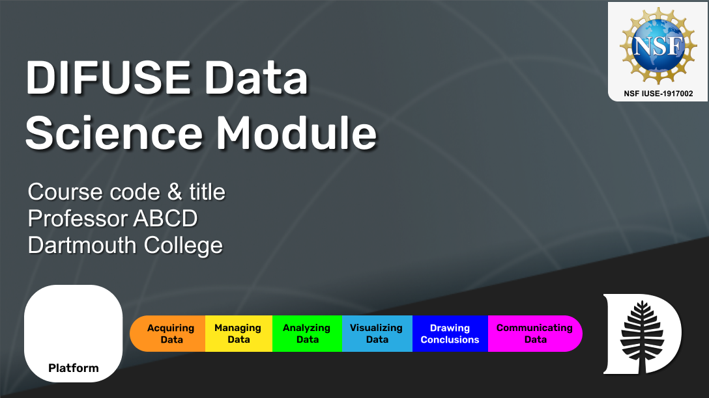

# ABCD 00 DIFUSE Module 

## Contributors: Jane Doe ('24), Muhammad Aronno ('23), and Professor Craig Silsby (PI) 
[list student contributors first, then professor/instructors contributors, then the PI(s) (primary investigator) on the team, and finally the project manager.]

This module was developed through the DIFUSE project at Dartmouth College and funded by the National Science Foundation award IUSE-1917002.

| | <a rel="license" href="http://creativecommons.org/licenses/by-sa/4.0/"> </a>This work is licensed under a <a rel="license" href="http://creativecommons.org/licenses/by-sa/4.0/">Creative Commons Attribution-ShareAlike 4.0 International License</a>. |
|---------|----------|

# Module Overview
## Module Objective 
State module objective. Think "what will students gain from this module?"

## Student Learning Objectives
List student learning objectives. What do you want the students to have learnt from the module?
1.	...
2.	...
3.	...

## Module Description
In 3-5 sentences, describe the workflow of the module. How many sections are there and what does each section focus on?

### Data
What are the datasets used in the module? Where are they from and what are they for?

### Platform
Where is the module hosted (MATLAB, Google Colab, R ...)?

## Schedule and Links
Use this page to get an idea of the timeline of the module, what components are involved, and what documents are related to each component. This is the schedule intended for module deployment by the DIFUSE team, though instructors are welcome to modify the timeline to fit their course environment.

Ensure links under "Linked course content" redirect to actual module components. Follow the template for linkage

| Date             |  In/Out of Class | Assignment Description                     | Linked course content                                    | Assignment Files (Linked to Repository Contents) |
|------------------|-----------------|--------------------------------------------------|-------------------------------------------------|--------------------------------------------------|
| Week 1 | Out of class      | Set #1: ...  | Course content|[Problem Set 1](completed_module/components/assignment1/) |
| Week 2 | In class      | Set #2: ... | 	Course content |[Problem Set 2](completed_module/public/components/assignment2/) |

## Course Information
This course was developed for a [subject] course(s), <a href="http://dartmouth.smartcatalogiq.com/current/orc/Departments-Programs-Undergraduate/Sociology/SOCY-Sociology/SOCY-34">[name of original course(s), link to ORC catalog]</a>, at Dartmouth College (or whichever college) which explores  ... .The course is a lower major level course in the XXX Department. While there are no prerequisites, most students have courses in XXX and have experience in XXX. 

[replace with an adequate description of student prerequsites to take original course]

---

| | <a rel="license" href="http://creativecommons.org/licenses/by-sa/4.0/"> </a>This work is licensed under a <a rel="license" href="http://creativecommons.org/licenses/by-sa/4.0/">Creative Commons Attribution-ShareAlike 4.0 International License</a>. |
|---------|----------|

For instructors and interested parties, the history of this repository (with detailed commits), can be found [here](https://github.com/difuse-dartmouth/SOCY34_F21/commits/main/).
